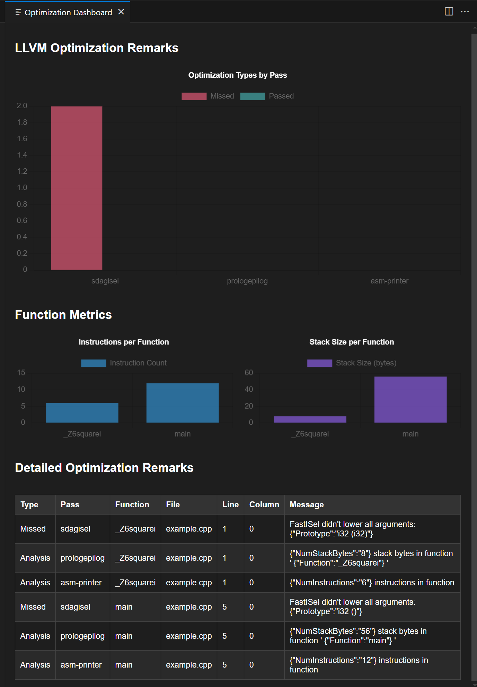

# Optviz

A VS Code extension for visualizing optimization insights from LLVM, NVCC, XLA and more compilers.

## Features

*   **Detailed Optimization Remark Visualization:**
    *   Parses and displays LLVM optimization remarks from `.opt.yaml` files.
    *   Categorizes remarks into `Passed` (optimizations applied), `Missed` (optimizations not applied), and `Analysis` (compiler analysis messages).
    *   Shows the specific optimization `Pass` that generated the remark.
    *   Pinpoints the exact source code location (File, Line, Column) for each remark.
    *   Displays the detailed message from the compiler for each remark.
*   **Compiler Metrics Overview:**
    *   Extracts and visualizes key metrics on a per-function basis, including:
        *   Instruction Count
        *   Stack Size
*   **Interactive Chart Dashboard:**
    *   Presents data in an easy-to-understand graphical dashboard.
    *   Likely includes charts showing the distribution of Passed, Missed, and Analysis remarks per optimization pass.
    *   Likely includes visualizations for comparing function metrics (e.g., bar charts for instruction counts or stack sizes).
*   **Support for Multiple Compilers (as stated in `package.json` description):**
    *   Designed to support insights from LLVM, NVCC, XLA, and more (though current implementation details focus on LLVM).

## Requirements

*   Visual Studio Code (latest stable version is recommended).

## How to Use/Installation

### Installation

1.  **Launch VS Code.**
2.  Go to the **Extensions** view:
    *   Click the Extensions icon in the Activity Bar on the side of the window.
    *   Or press `Ctrl+Shift+X` (Windows, Linux) or `Cmd+Shift+X` (macOS).
3.  **Search for "Optviz"** in the Extensions view search bar.
4.  Click **Install** on the "Optviz" extension.
5.  Once installed, the extension is ready to be used. It activates when you run its command for the first time.

### How to Use

1.  **Open your project** in VS Code that contains compiler optimization remark files (e.g., LLVM's `.opt.yaml` files).
2.  **Generate Optimization Remarks:** Ensure you have already compiled your code with the necessary flags to produce optimization remark files. For example, with Clang (LLVM):
    ```bash
    clang -O3 -Rpass=.* -Rpass-missed=.* -Rpass-analysis=.* -fsave-optimization-record your_code.c -o your_executable
    ```
    This will typically produce a `your_code.opt.yaml` file (or similar, depending on your source file names and compiler version) in the build directory.
3.  **Open the Command Palette:**
    *   Press `Ctrl+Shift+P` (Windows, Linux) or `Cmd+Shift+P` (macOS).
4.  **Run the Optviz command:**
    *   Type `Load and Show Optimization Dashboard` in the Command Palette and press Enter.
    *   Alternatively, you can directly type the command ID: `optviz.loadAndShowDashboard`.
5.  **Select Your Remark File:**
    *   A file dialog will appear. Navigate to and select your optimization remark file (e.g., `your_code.opt.yaml`).
6.  **View the Dashboard:**
    *   Optviz will parse the selected file and open a new panel displaying the Optimization Dashboard, with charts and details about the compiler's optimization remarks.

### Dashboard Example

Below is an example of the Optviz dashboard visualizing LLVM optimization remarks:



The dashboard provides a breakdown of optimization passes, remark types (Passed, Missed, Analysis), and function metrics like instruction counts and stack sizes.

### Supported Compilers/Input Formats

Optviz currently provides direct support for:

*   **LLVM:** Parses optimization remarks from `.opt.yaml` files generated by Clang/LLVM compilers. Ensure your compiler version is recent enough to support the `-fsave-optimization-record` flag and YAML output format.

Support for the following is planned for future releases:

*   **NVCC:** NVIDIA CUDA Compiler remarks.
*   **XLA:** Accelerated Linear Algebra remarks.
*   And more compilers that provide structured optimization feedback.

If you have a specific compiler or remark format you'd like to see supported, please open an issue on our GitHub repository!

## Contributing

Contributions are welcome! Please follow the standard GitHub flow:
1.  Fork the repository.
2.  Create a new branch for your feature or bug fix.
3.  Commit your changes.
4.  Push your branch and submit a Pull Request.

(A `CONTRIBUTING.md` file with more detailed guidelines will be added later.)

## Acknowledgements

The initial version and core idea of this extension were inspired by the [llvm-remarks-viewer-demo](https://github.com/leyli16/llvm-remarks-viewer-demo) project.

## License

This project is licensed under the terms of the LICENSE file.
